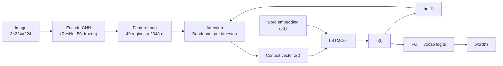

# Multimodal Neural Image Caption Generator

[](https://github.com/<your-username>/image-caption-generator/actions/workflows/ci.yml)


[](./LICENSE)

A CLIP ViT-B/32 (or ResNet-50/101/152 — swappable, see Design decisions)
encoder + Bahdanau attention + LSTM decoder, following *Show, Attend
and Tell* (Xu et al., 2015), trained on progressively larger/more
diverse data (Flickr8k → COCO 50k → COCO 113k) and, separately, a
progressively better-aligned encoder (ResNet → CLIP) — see Results for
the full experimental progression.

Given an image, the model generates a natural-language caption while
learning to attend to different spatial regions of the image for each
generated word.

## Live demo
[Link to Streamlit Community Cloud deployment — add once deployed, see `DEPLOY_STREAMLIT.md`
(or `DEPLOY_SPACES.md` for Hugging Face Spaces instead)]

The Streamlit app (`app.py`) offers three captioning backends,
selectable in the UI. **The model this project is actually about is
the custom one** — the ResNet + Bahdanau attention + LSTM decoder
described below, designed, trained, and evaluated from scratch on
Flickr8k/COCO. It's the default, and it's the one with real BLEU/
METEOR/CIDEr numbers in the Results section. The other two are
off-the-shelf pretrained models, included so the live demo still gives
a good result on photos outside Flickr8k's narrow distribution — they
are not part of this project's ML work, and the UI labels them as such.

- **🎓 My trained model (default)** — this project's own architecture.
  Shorter, more generic captions than the options below, and
  occasional hallucination on out-of-distribution scenes — an honest,
  expected consequence of training on a few thousand images instead of
  hundreds of millions (see Limitations).
- **BLIP (external, reference only)** — Salesforce's
  `blip-image-captioning-large`, pretrained on ~14M image-text pairs.
  Short but accurate one-line captions, free, runs locally, no API key
  needed.
- **Claude (external, reference only)** — calls the Anthropic API with
  the image and a prompt asking for a full paragraph naming every
  object, its color/material, spatial position, and the environment
  itself. The most detailed option, and the only one that resembles
  hand-written photo-catalog description — caption models (BLIP, and
  this project's own model) are trained on short reference captions
  and structurally cannot produce that regardless of how much they're
  trained; instruction-tuned vision-language models are a different
  task. Requires an `ANTHROPIC_API_KEY` (entered in the UI or set as
  an environment variable before launch); costs a small amount per
  image.

All three backends support uploading one or multiple images at once;
each gets its own caption in the results list.

## Architecture

```
Input image (3×224×224)
    → ResNet-50/101/152 encoder (frozen, pretrained on ImageNet)
    → Feature map (49 regions × 2048-d)
    → Attention mechanism ↔ LSTM decoder (word-by-word, with attention
      recomputed at every step)
    → Generated caption
```



## Design decisions

- **Bahdanau (additive) attention over Luong (multiplicative)**: matches
  the reference paper, and is more numerically stable at the hidden
  sizes used here (256-512).
- **LSTM decoder over a Transformer decoder**: for a single-GPU,
  Flickr8k-scale project, a recurrent decoder is cheaper to train and
  easier to reason about end-to-end. A Transformer decoder with
  cross-attention to the 49 image tokens is a natural next step once
  there's a larger dataset to justify it (see Roadmap).
- **Frozen encoder**: both `EncoderCNN` and `EncoderCLIP` stay frozen
  throughout training rather than fine-tuning end-to-end. On a dataset
  this small, unfreezing the whole network risks catastrophic
  forgetting of the pretrained features; both encoders' `fine_tune=True`
  unfreezes only their last block (residual block for ResNet,
  transformer block for CLIP) as a middle ground.
- **CLIP encoder over ResNet** (see Results): swapped in after the
  50k→113k ResNet run showed diminishing returns from more data alone,
  which raised a specific hypothesis — that ImageNet-classification
  features (not language-aligned) had become the bottleneck, not data
  volume. Re-running the same 113k images through a CLIP ViT-B/32
  encoder confirmed it: +12.4% BLEU-4 over the ResNet run on identical
  data. `EncoderCNN` is kept in the codebase (not deleted) specifically
  so this comparison stays reproducible.
- **Doubly stochastic attention regularization** (Xu et al. 2015,
  Section 4.2.1): the training loss includes a term encouraging the
  model to attend to every image region roughly equally over the course
  of a full caption, which empirically produces more sensible attention
  maps. See `attention_regularization` in `train.py`.
- **Teacher forcing during training**: the decoder is fed the
  ground-truth previous token rather than its own prediction, which
  trains faster and more stably at the cost of a train/inference
  mismatch (exposure bias) — a known, explicitly-acknowledged limitation
  of this architecture family, not an oversight.

## Results

`best_checkpoint.pth` (the checkpoint shipped in this repo and loaded
by default in `app.py`'s "My trained model" backend) uses a **CLIP
ViT-B/32 vision encoder**, swapped in from the original ImageNet-
pretrained ResNet, trained on the full 113,000-image COCO Karpathy
train split and evaluated on a held-out 5,000-image test split it
never saw during training:

| Metric | Score |
|---|---|
| BLEU-1 | 0.6789 |
| BLEU-2 | 0.5036 |
| BLEU-3 | 0.3564 |
| BLEU-4 | 0.2490 |
| CIDEr | 0.7729 |

Trained for 10 epochs (best checkpoint at epoch 9, `val_loss=2.2332`)
locally on an Apple M4 Pro (MPS) via `scripts/train_local_coco.py
--encoder clip-vit-base-patch32` — see "Three ways to train" below.
METEOR skipped (see Engineering notes).

Four checkpoints total, kept for comparison (`best_checkpoint_flickr8k.pth`,
`best_checkpoint_coco_50k.pth`, `best_checkpoint_coco_113k_resnet.pth`,
and the current CLIP-encoder one):

| Metric | Flickr8k (6k, ResNet) | COCO 50k (ResNet) | COCO 113k (ResNet) | **COCO 113k (CLIP encoder)** |
|---|---|---|---|---|
| BLEU-1 | 0.5517 | 0.6363 | 0.6440 | **0.6789** |
| BLEU-2 | 0.3737 | 0.4600 | 0.4650 | **0.5036** |
| BLEU-3 | 0.2437 | 0.3188 | 0.3221 | **0.3564** |
| BLEU-4 | 0.1585 | 0.2195 | 0.2215 | **0.2490** |
| METEOR | 0.1953 | _skipped_ | _skipped_ | _skipped_ |
| CIDEr | 0.4521 | 0.6680 | 0.6781 | **0.7729** |

Three honest findings from these four runs, not one:

- **6k → 50k images (same ResNet encoder): a large, real improvement**
  (+38% BLEU-4, +48% CIDEr). The same encoder/attention/decoder code
  produced a meaningfully better model purely from a larger, more
  varied dataset — evidence that quality was data-limited at this
  point.
- **50k → 113k images (same ResNet encoder): a much smaller
  improvement** (+0.9% BLEU-4, +1.5% CIDEr), with validation loss
  visibly plateauing in the last 3 epochs. More than doubling the
  training data bought a real but small gain — classic diminishing
  returns, and a signal that data volume had stopped being the
  bottleneck.
- **Same 113k images, ResNet → CLIP encoder: another large, real
  improvement** (+12.4% BLEU-4, +14.0% CIDEr over the ResNet-113k
  run — bigger than the entire 50k→113k data increase gave). This
  is the direct test of the hypothesis the diminishing-returns finding
  raised: if more data of the same kind wasn't helping much anymore,
  maybe the *encoder* had become the bottleneck. `EncoderCNN`'s ResNet
  backbone is pretrained via ImageNet classification (1000-way object
  labels, no linguistic structure). `EncoderCLIP` is pretrained
  contrastively to align images directly with their natural-language
  captions (see `EncoderCLIP`'s docstring in
  `src/caption_generator/models/encoder.py`) — features already
  language-aligned before the decoder ever sees them, versus features
  optimized for a completely different, non-linguistic objective.
  Every training epoch scored better with CLIP than the equivalent
  ResNet epoch, not just the final number, and validation loss
  plateaued later in training than the ResNet run did.

Together these three findings tell a coherent story: identify a
plateau, form a specific hypothesis about *why* (data vs. architecture),
run the controlled comparison, and let the result confirm or reject it.
The 6k→113k→CLIP progression is still well short of a production-scale
pretrained model (see `app.py`'s BLIP/BLIP-2/Claude backends above) —
even 113k images is orders of magnitude below the hundreds of millions
those are trained on — but it's a genuine, measured improvement at
every step, not just more training for its own sake.

## Three ways to train

Same architecture, same `train_one_epoch`/`validate` loop, three
different places to run it — pick based on what hardware you have:

| | Flickr8k (baseline) | COCO via Colab/Kaggle | COCO via local script |
|---|---|---|---|
| Entry point | `notebooks/train_colab.ipynb` | `notebooks/train_colab_coco.ipynb` / `notebooks/train_kaggle_coco.ipynb` | `scripts/train_local_coco.py` |
| Training images | ~6,000 | up to 50,000 (configurable) | up to 113,000 (full Karpathy train split, configurable) |
| Split | ad-hoc 80/10/10 | Karpathy split | Karpathy split |
| Where it runs | Colab free-tier GPU | Colab/Kaggle free-tier GPU | your own machine (CUDA, Apple Silicon MPS, or CPU) |
| Runtime | ~30-60 min | several hours, subject to session limits | ~35-40 min/epoch at 50k images, ~80 min/epoch at 113k images, on an M4 Pro (MPS); no session limits, but ties up your machine for hours |
| Resumable | no | yes (Drive/Kaggle-output-backed) | yes (`data/coco/latest_checkpoint_coco.pth`) |

`scripts/train_local_coco.py` exists for machines with usable local
acceleration (CUDA or Apple Silicon MPS) where free-tier session limits
are more friction than they're worth. It downloads the same
`yerevann/coco-karpathy` Hugging Face dataset as the Colab/Kaggle
notebooks, caches the resulting (image, caption) pairs to
`data/coco/pairs_cache.json` so re-runs skip re-downloading, and saves
a resumable checkpoint after every epoch — safe to interrupt (Ctrl-C,
sleep, crash, an actual machine reboot) and re-run.

```bash
python scripts/train_local_coco.py --encoder clip-vit-base-patch32 --n-train 113000 --n-val 5000 --n-test 5000  # full run (what produced best_checkpoint.pth)
python scripts/train_local_coco.py --n-train 5000                                                                 # smaller/faster run, default ResNet encoder
```

`--encoder` chooses between `resnet50` (default, `EncoderCNN`, ImageNet-
classification pretraining) and `clip-vit-base-patch32` (`EncoderCLIP`,
CLIP's contrastive image-text pretraining — see the Results section
above for why this mattered here). Checkpoint filenames are suffixed
by encoder (`best_checkpoint_coco_clip.pth` vs `best_checkpoint_coco.pth`)
so the two can't clobber each other, and each checkpoint records which
encoder produced it (`encoder_type` key) so `app.py`/`evaluate.py` load
the right architecture and input normalization automatically.

Four things learned running this for real, multi-hour, unattended:

- **Keep the machine from sleeping mid-run** — sleep pauses the
  process but the wall-clock timer in the epoch log keeps counting
  through the sleep, which looks like a huge slowdown but isn't. Use
  `caffeinate -i -w <pid>` on macOS.
- **A reboot kills the run** (it's a plain background process, not a
  daemon) — but nothing is lost: the image cache and pairs cache
  survive on disk, so re-running just skips the download and resumes
  training from the last saved epoch.
- **A checkpoint from a differently-sized run cannot be resumed into a
  new run** — vocab size depends on the training corpus, so
  `latest_checkpoint_coco.pth` from a 50k run has incompatible
  embedding/output-layer shapes for a 113k run. The script now detects
  a vocab-size mismatch and starts fresh with a warning instead of
  crashing (or, worse, silently loading corrupted weights) — but move
  or delete a previous run's `data/coco/latest_checkpoint_coco.pth`
  before starting a differently-sized run to avoid the warning
  entirely.
- If training seems to be running far slower than expected with no
  errors, check for unrelated system load before assuming the script
  is broken. Two real causes hit here, both external to the training
  code itself: macOS Spotlight indexing the freshly downloaded
  113k-image dataset (`mediaanalysisd`/`spotlightknowledged` at
  80-97% CPU) — fixed with a `data/coco/.metadata_never_index` marker
  file (standard macOS mechanism to exclude a directory from Spotlight,
  no `sudo` needed) — and, separately, general system memory pressure
  from having many other applications open at once, which showed up as
  `vm.swapusage` near its ceiling and a training process burning far
  less CPU time than wall-clock time elapsed (i.e. mostly blocked
  waiting on swapped-out memory, not actually computing). Closing
  memory-heavy applications (browsers, IDEs, VM/container backends)
  resolved it; this is a real constraint of running multi-hour training
  on a machine you're also using for other work, not a bug in the
  script.

### A note on where the COCO run actually executes

`notebooks/train_colab_coco.ipynb` targets Colab, but Colab's free tier
has undocumented, fluctuating session limits (Google's own FAQ: usage
limits "vary over time" and are deliberately not published) — in
practice, sessions were reclaimed before a single epoch finished on
this dataset size. Two things made this tractable rather than switching
away entirely:

- The training loop saves full resumable state (model + optimizer +
  scheduler + epoch number) after every epoch, backed up to Drive, and
  auto-resumes from it in a fresh session instead of restarting.
- The downloaded image set is archived to Drive after a successful
  download, so a reconnect doesn't re-pay the ~35-minute download cost
  every time.

`notebooks/train_kaggle_coco.ipynb` is the same training logic adapted
for **Kaggle Notebooks**, which publishes an actual quota (30 GPU-hours/
week, up to 12 hours/session) and supports background execution (Save
Version → Save & Run All) that survives closing the browser tab —
avoiding most of the above by construction rather than working around
it. Either notebook produces a checkpoint evaluable the same way; which
one to use is a platform-availability choice, not an architecture one.

## Attention visualizations


_Generated with `visualize_attention.py`. Each panel shows which image
region the model attended to while generating that specific word._

## Limitations

- Trained on Flickr8k only (8,000 images) — small by modern standards,
  so generalization to unusual scenes is limited
- Encoder kept frozen throughout training (no fine-tuning), which trades
  some accuracy for training stability/speed within the project timeline
- Occasional repetitive captions on out-of-distribution images, a known
  symptom of exposure bias in teacher-forced sequence models — mitigated
  but not eliminated by n-gram-repetition blocking in
  `CaptionModel.generate_greedy`/`generate_beam` (see Engineering notes)
- **Object hallucination on out-of-distribution scenes**: on a test
  photo of an empty storefront with no people, the model captioned "a
  person is sitting on a sidewalk in front of a store" — no person is
  present. Flickr8k is heavily biased toward photos of people and
  animals in action; faced with a scene outside that distribution, the
  model falls back to its strongest prior (a person is doing something)
  rather than correctly reporting absence. This is a dataset-scale
  limitation, not a decoding-strategy bug — no amount of beam search or
  repetition blocking fixes a belief the model doesn't have the training
  data to correct.
- Evaluated with greedy and beam-search decoding only — no length
  normalization or diverse beam search

## Roadmap

Honest next steps, not yet implemented:

- **Fine-tune the CLIP encoder** instead of keeping it frozen (see
  Design decisions) — the natural next experiment in the same spirit
  as the ResNet→CLIP swap: is the *frozen* CLIP encoder now the
  bottleneck, the way frozen ResNet was before it?
- **Transformer decoder variant**, benchmarked against the current LSTM
  decoder on the same data/metrics as a case study in trade-offs
- **Visual question answering** is explicitly out of scope for this
  architecture — captioning and VQA are different tasks (VQA needs a
  text-question input and typically a different decoder design); doing
  that well would mean building on a pretrained vision-language model
  (e.g. BLIP-2, LLaVA) rather than extending this one from scratch
- **Batch/multi-image captioning** in the Streamlit UI (the model
  already supports batched inference; the demo currently processes
  uploads one at a time in a loop rather than as a true batch)

## Engineering notes

- **Installable package**: `src/caption_generator/` is a real Python
  package (`pip install -e .`), not a folder of scripts stitched
  together with `sys.path.insert` -- imports are ordinary
  `from caption_generator.models.encoder import EncoderCNN` throughout,
  in tests, scripts, and the Streamlit app alike.
- **Configurable backbone**: `EncoderCNN(backbone="resnet101")` swaps the
  encoder with no downstream changes — all supported backbones output the
  same 2048-d feature vector per region (see
  `src/caption_generator/models/encoder.py`).
- **LR scheduling + early stopping**: `train.py` halves the learning rate
  when validation loss plateaus for 2 epochs, and stops training after 4
  epochs with no improvement, rather than a fixed epoch count.
- **N-gram repetition blocking at decode time**: `generate_greedy` and
  `generate_beam` skip any candidate word that would recreate a 3-gram
  already generated (`no_repeat_ngram_size=3` by default, matching
  HuggingFace's `generate()` convention). Removes visible repetition
  loops ("a white dress and a white dress") without retraining — it
  does not and cannot fix factual accuracy, only decoding-level
  repetition (see Limitations).
- **METEOR made optional in `evaluate()`** (`skip_meteor=True`):
  `pycocoevalcap`'s METEOR scorer shells out to a Java subprocess and
  parses its stdout line by line; observed in practice to both throw
  parsing errors on some outputs and, after a caught failure, leave
  that subprocess in a state where cleanup hangs rather than fails
  fast. BLEU and CIDEr don't share this dependency and are unaffected.
  A real, reproducible environment issue, not a modeling one.
- **Tested, not just self-tested**: `tests/` has 30 pytest tests covering
  every module (shapes, gradient flow, vocabulary edge cases, dataset
  batching/augmentation, greedy/beam decoding, n-gram blocking) — runs
  in ~4 seconds, no GPU or dataset download required. CI runs it on
  every push.

## Setup

```bash
git clone <this-repo>
cd image-caption-generator
python3 -m venv .venv && source .venv/bin/activate
pip install -e ".[dev]"   # installs the package + pytest, editable
pytest                     # verify everything works, ~4s
```

See [`SETUP_DATA.md`](./SETUP_DATA.md) for downloading Flickr8k, and
[`notebooks/train_colab.ipynb`](./notebooks/train_colab.ipynb) for a
ready-to-run Colab notebook that does the whole pipeline on a free GPU.
For a larger, more diverse COCO subset instead, use
[`notebooks/train_colab_coco.ipynb`](./notebooks/train_colab_coco.ipynb)
(Colab) or
[`notebooks/train_kaggle_coco.ipynb`](./notebooks/train_kaggle_coco.ipynb)
(Kaggle, recommended if Colab's free-tier session limits are an issue)
— see Two training tiers below for the full rationale.

```bash
python -m caption_generator.train                 # trains, saves best_checkpoint.pth
python -m caption_generator.evaluate               # BLEU / METEOR / CIDEr on the test split
python -m caption_generator.visualize_attention \
    --checkpoint best_checkpoint.pth --image path/to/image.jpg
streamlit run app.py                                # local web demo
```

See [`DEPLOY_SPACES.md`](./DEPLOY_SPACES.md) to put the demo on a public
URL (Hugging Face Spaces, free tier).

## Project structure

```
image-caption-generator/
├── pyproject.toml             # package metadata + dependencies (source of truth)
├── src/caption_generator/
│   ├── data/
│   │   ├── vocabulary.py      # Vocabulary class, tokenization
│   │   └── dataset.py          # ImageCaptionDataset + collate_fn
│   ├── models/
│   │   ├── encoder.py           # EncoderCNN (ResNet-50/101/152) + EncoderCLIP (CLIP ViT-B/32)
│   │   ├── attention.py         # Bahdanau attention
│   │   ├── decoder.py            # LSTM decoder with attention
│   │   └── caption_model.py     # composed model + greedy/beam inference
│   ├── train.py
│   ├── evaluate.py
│   └── visualize_attention.py
├── tests/                     # pytest suite, no GPU/dataset needed
├── notebooks/
│   ├── train_colab.ipynb        # Flickr8k baseline training notebook (Colab)
│   ├── train_colab_coco.ipynb   # larger, more diverse COCO training notebook (Colab)
│   └── train_kaggle_coco.ipynb  # same COCO training, adapted for Kaggle's longer/more predictable sessions
├── scripts/
│   └── train_local_coco.py    # COCO training on local CUDA/MPS hardware, --encoder resnet50|clip-vit-base-patch32
├── .github/workflows/ci.yml  # runs pytest on every push
├── app.py                    # Streamlit demo (imports the installed package)
├── SETUP_DATA.md
├── DEPLOY_SPACES.md
└── requirements.txt           # mirrors pyproject.toml, needed by Hugging Face Spaces
```

## Acknowledgments

Architecture based on Xu et al., *Show, Attend and Tell: Neural Image
Caption Generation with Visual Attention* (2015). Implementation informed
by [sgrvinod's PyTorch tutorial on image captioning](https://github.com/sgrvinod/a-PyTorch-Tutorial-to-Image-Captioning),
adapted here to current PyTorch/torchvision APIs and rewritten independently.
