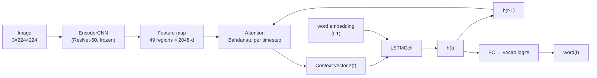

# Multimodal Neural Image Caption Generator

[](https://github.com/<your-username>/image-caption-generator/actions/workflows/ci.yml)


[](./LICENSE)

A ResNet-50 (or ResNet-101/152 — swappable) encoder + Bahdanau attention +
LSTM decoder, trained on Flickr8k, following *Show, Attend and Tell*
(Xu et al., 2015).

Given an image, the model generates a natural-language caption while
learning to attend to different spatial regions of the image for each
generated word.

## Live demo
[Link to Hugging Face Spaces deployment — add once deployed, see `DEPLOY_SPACES.md`]

## Architecture

```
Input image (3×224×224)
    → ResNet-50/101/152 encoder (frozen, pretrained on ImageNet)
    → Feature map (49 regions × 2048-d)
    → Attention mechanism ↔ LSTM decoder (word-by-word, with attention
      recomputed at every step)
    → Generated caption
```



Full architecture writeup, math, and design decisions: see
[`Extended_Blueprint_Image_Caption_Generator.md`](./Extended_Blueprint_Image_Caption_Generator.md)
in this repo.

## Results

Evaluated on the Flickr8k test split (1,000 images, 5 reference captions each):

| Metric | Score |
|---|---|
| BLEU-1 | _fill in after evaluate.py run_ |
| BLEU-2 | |
| BLEU-3 | |
| BLEU-4 | |
| METEOR | |
| CIDEr | |

## Attention visualizations


_Generated with `visualize_attention.py`. Each panel shows which image
region the model attended to while generating that specific word._

## Limitations

- Trained on Flickr8k only (8,000 images) — small by modern standards,
  so generalization to unusual scenes is limited
- Encoder kept frozen throughout training (no fine-tuning), which trades
  some accuracy for training stability/speed within the project timeline
- Occasional repetitive captions on out-of-distribution images, a known
  symptom of exposure bias in teacher-forced sequence models
- Evaluated with greedy and beam-search decoding only — no length
  normalization or diverse beam search

## Engineering notes

- **Configurable backbone**: `EncoderCNN(backbone="resnet101")` swaps the
  encoder with no downstream changes — all supported backbones output the
  same 2048-d feature vector per region (see `models/encoder.py`).
- **LR scheduling + early stopping**: `train.py` halves the learning rate
  when validation loss plateaus for 2 epochs, and stops training after 4
  epochs with no improvement, rather than a fixed epoch count.
- **Tested, not just self-tested**: `tests/` has 26 pytest tests covering
  every module (shapes, gradient flow, vocabulary edge cases, dataset
  batching/augmentation, greedy/beam decoding) — runs in ~3 seconds, no
  GPU or dataset download required. CI runs it on every push.

## Setup

```bash
git clone <this-repo>
cd image-caption-generator
python3 -m venv .venv && source .venv/bin/activate
pip install -r requirements-dev.txt   # includes pytest
pytest                                  # verify everything works, ~3s
```

See [`SETUP_DATA.md`](./SETUP_DATA.md) for downloading Flickr8k, and
[`notebooks/train_colab.ipynb`](./notebooks/train_colab.ipynb) for a
ready-to-run Colab notebook that does the whole pipeline on a free GPU.

```bash
python train.py          # trains and saves best_checkpoint.pth
python evaluate.py        # BLEU / METEOR / CIDEr on the test split
python visualize_attention.py --checkpoint best_checkpoint.pth --image path/to/image.jpg
streamlit run app.py      # local web demo
```

See [`DEPLOY_SPACES.md`](./DEPLOY_SPACES.md) to put the demo on a public
URL (Hugging Face Spaces, free tier).

## Project structure

```
image-caption-generator/
├── data/
│   ├── vocabulary.py      # Vocabulary class, tokenization
│   └── dataset.py          # Flickr8kDataset + collate_fn
├── models/
│   ├── encoder.py           # ResNet-50/101/152 feature extractor
│   ├── attention.py         # Bahdanau attention
│   ├── decoder.py            # LSTM decoder with attention
│   └── caption_model.py     # composed model + greedy/beam inference
├── tests/                     # pytest suite, no GPU/dataset needed
├── notebooks/
│   └── train_colab.ipynb    # end-to-end training notebook for Colab
├── .github/workflows/ci.yml  # runs pytest on every push
├── train.py
├── evaluate.py
├── visualize_attention.py
├── app.py                    # Streamlit demo
├── SETUP_DATA.md
├── DEPLOY_SPACES.md
└── requirements.txt
```

## Acknowledgments

Architecture based on Xu et al., *Show, Attend and Tell: Neural Image
Caption Generation with Visual Attention* (2015). Implementation informed
by [sgrvinod's PyTorch tutorial on image captioning](https://github.com/sgrvinod/a-PyTorch-Tutorial-to-Image-Captioning),
adapted here to current PyTorch/torchvision APIs and rewritten independently.
