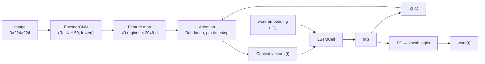
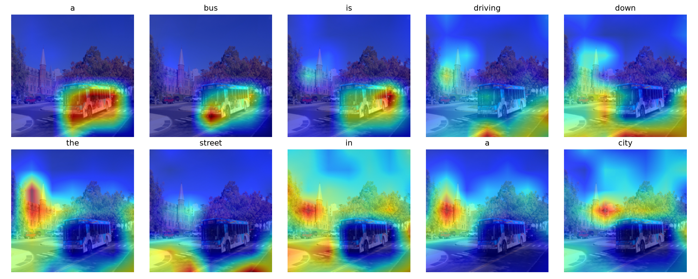

# Multimodal Neural Image Caption Generator

[](https://github.com/<your-username>/image-caption-generator/actions/workflows/ci.yml)


[](./LICENSE)

A ResNet-50 (or ResNet-101/152 — swappable) encoder + Bahdanau attention +
LSTM decoder, trained on Flickr8k, following *Show, Attend and Tell*
(Xu et al., 2015).

Given an image, the model generates a natural-language caption while
learning to attend to different spatial regions of the image for each
generated word.

## Live demo
[Link to Hugging Face Spaces deployment — add once deployed, see `DEPLOY_SPACES.md`]

## Architecture

```
Input image (3×224×224)
    → ResNet-50/101/152 encoder (frozen, pretrained on ImageNet)
    → Feature map (49 regions × 2048-d)
    → Attention mechanism ↔ LSTM decoder (word-by-word, with attention
      recomputed at every step)
    → Generated caption
```



## Design decisions

- **Bahdanau (additive) attention over Luong (multiplicative)**: matches
  the reference paper, and is more numerically stable at the hidden
  sizes used here (256-512).
- **LSTM decoder over a Transformer decoder**: for a single-GPU,
  Flickr8k-scale project, a recurrent decoder is cheaper to train and
  easier to reason about end-to-end. A Transformer decoder with
  cross-attention to the 49 image tokens is a natural next step once
  there's a larger dataset to justify it (see Roadmap).
- **Frozen encoder**: the ResNet backbone stays frozen throughout
  training rather than fine-tuning end-to-end. On a dataset this small,
  unfreezing the whole network risks catastrophic forgetting of the
  pretrained ImageNet features; `EncoderCNN(fine_tune=True)` unfreezes
  only the last residual block as a middle ground.
- **Doubly stochastic attention regularization** (Xu et al. 2015,
  Section 4.2.1): the training loss includes a term encouraging the
  model to attend to every image region roughly equally over the course
  of a full caption, which empirically produces more sensible attention
  maps. See `attention_regularization` in `train.py`.
- **Teacher forcing during training**: the decoder is fed the
  ground-truth previous token rather than its own prediction, which
  trains faster and more stably at the cost of a train/inference
  mismatch (exposure bias) — a known, explicitly-acknowledged limitation
  of this architecture family, not an oversight.

## Results

Evaluated on the Flickr8k test split (1,000 images, 5 reference captions each):

| Metric | Score |
|---|---|
| BLEU-1 | 0.5517 |
| BLEU-2 | 0.3737 |
| BLEU-3 | 0.2437 |
| BLEU-4 | 0.1585 |
| METEOR | 0.1953 |
| CIDEr | 0.4521 |

Trained for 13 epochs (early-stopped; best checkpoint at epoch 9,
`val_loss=2.7392`) on a T4 GPU via `notebooks/train_colab.ipynb`.

## Two training tiers

This repo supports training the same architecture on two datasets of
very different scale, deliberately kept as separate notebooks rather
than one config flag, so both results stand on their own:

| | Flickr8k (baseline) | COCO (scaled) |
|---|---|---|
| Notebook | `notebooks/train_colab.ipynb` | `notebooks/train_colab_coco.ipynb` |
| Training images | ~6,000 | up to 50,000 (configurable) |
| Split | ad-hoc 80/10/10 | Karpathy split (matches published baselines) |
| Runtime | ~30-60 min | several hours (download + train) |
| Known failure mode | hallucinates objects/people on scenes outside Flickr8k's narrow people/animal-heavy distribution (see Limitations) | tests whether more scene diversity fixes that |

The Flickr8k run is what produced the Results table above. The COCO
notebook exists specifically to test the hallucination finding from
that run against a much larger, more diverse dataset — fill in its
results here once that run completes:

| Metric | Flickr8k | COCO |
|---|---|---|
| BLEU-4 | 0.1585 | _pending_ |
| METEOR | 0.1953 | _pending_ |
| CIDEr | 0.4521 | _pending_ |

### A note on where the COCO run actually executes

`notebooks/train_colab_coco.ipynb` targets Colab, but Colab's free tier
has undocumented, fluctuating session limits (Google's own FAQ: usage
limits "vary over time" and are deliberately not published) — in
practice, sessions were reclaimed before a single epoch finished on
this dataset size. Two things made this tractable rather than switching
away entirely:

- The training loop saves full resumable state (model + optimizer +
  scheduler + epoch number) after every epoch, backed up to Drive, and
  auto-resumes from it in a fresh session instead of restarting.
- The downloaded image set is archived to Drive after a successful
  download, so a reconnect doesn't re-pay the ~35-minute download cost
  every time.

`notebooks/train_kaggle_coco.ipynb` is the same training logic adapted
for **Kaggle Notebooks**, which publishes an actual quota (30 GPU-hours/
week, up to 12 hours/session) and supports background execution (Save
Version → Save & Run All) that survives closing the browser tab —
avoiding most of the above by construction rather than working around
it. Either notebook produces a checkpoint evaluable the same way; which
one to use is a platform-availability choice, not an architecture one.

## Attention visualizations



_Generated with `visualize_attention.py`. Each panel shows which image
region the model attended to while generating that specific word._

## Limitations

- Trained on Flickr8k only (8,000 images) — small by modern standards,
  so generalization to unusual scenes is limited
- Encoder kept frozen throughout training (no fine-tuning), which trades
  some accuracy for training stability/speed within the project timeline
- Occasional repetitive captions on out-of-distribution images, a known
  symptom of exposure bias in teacher-forced sequence models — mitigated
  but not eliminated by n-gram-repetition blocking in
  `CaptionModel.generate_greedy`/`generate_beam` (see Engineering notes)
- **Object hallucination on out-of-distribution scenes**: on a test
  photo of an empty storefront with no people, the model captioned "a
  person is sitting on a sidewalk in front of a store" — no person is
  present. Flickr8k is heavily biased toward photos of people and
  animals in action; faced with a scene outside that distribution, the
  model falls back to its strongest prior (a person is doing something)
  rather than correctly reporting absence. This is a dataset-scale
  limitation, not a decoding-strategy bug — no amount of beam search or
  repetition blocking fixes a belief the model doesn't have the training
  data to correct.
- Evaluated with greedy and beam-search decoding only — no length
  normalization or diverse beam search

## Roadmap

Honest next steps, not yet implemented:

- **Transformer decoder variant**, benchmarked against the current LSTM
  decoder on the same data/metrics as a case study in trade-offs
- **Visual question answering** is explicitly out of scope for this
  architecture — captioning and VQA are different tasks (VQA needs a
  text-question input and typically a different decoder design); doing
  that well would mean building on a pretrained vision-language model
  (e.g. BLIP-2, LLaVA) rather than extending this one from scratch
- **Batch/multi-image captioning** in the Streamlit UI (the model
  already supports batched inference; the demo currently processes
  uploads one at a time in a loop rather than as a true batch)

## Engineering notes

- **Installable package**: `src/caption_generator/` is a real Python
  package (`pip install -e .`), not a folder of scripts stitched
  together with `sys.path.insert` -- imports are ordinary
  `from caption_generator.models.encoder import EncoderCNN` throughout,
  in tests, scripts, and the Streamlit app alike.
- **Configurable backbone**: `EncoderCNN(backbone="resnet101")` swaps the
  encoder with no downstream changes — all supported backbones output the
  same 2048-d feature vector per region (see
  `src/caption_generator/models/encoder.py`).
- **LR scheduling + early stopping**: `train.py` halves the learning rate
  when validation loss plateaus for 2 epochs, and stops training after 4
  epochs with no improvement, rather than a fixed epoch count.
- **N-gram repetition blocking at decode time**: `generate_greedy` and
  `generate_beam` skip any candidate word that would recreate a 3-gram
  already generated (`no_repeat_ngram_size=3` by default, matching
  HuggingFace's `generate()` convention). Removes visible repetition
  loops ("a white dress and a white dress") without retraining — it
  does not and cannot fix factual accuracy, only decoding-level
  repetition (see Limitations).
- **Tested, not just self-tested**: `tests/` has 30 pytest tests covering
  every module (shapes, gradient flow, vocabulary edge cases, dataset
  batching/augmentation, greedy/beam decoding, n-gram blocking) — runs
  in ~4 seconds, no GPU or dataset download required. CI runs it on
  every push.

## Setup

```bash
git clone <this-repo>
cd image-caption-generator
python3 -m venv .venv && source .venv/bin/activate
pip install -e ".[dev]"   # installs the package + pytest, editable
pytest                     # verify everything works, ~4s
```

See [`SETUP_DATA.md`](./SETUP_DATA.md) for downloading Flickr8k, and
[`notebooks/train_colab.ipynb`](./notebooks/train_colab.ipynb) for a
ready-to-run Colab notebook that does the whole pipeline on a free GPU.
For a larger, more diverse COCO subset instead, use
[`notebooks/train_colab_coco.ipynb`](./notebooks/train_colab_coco.ipynb)
(Colab) or
[`notebooks/train_kaggle_coco.ipynb`](./notebooks/train_kaggle_coco.ipynb)
(Kaggle, recommended if Colab's free-tier session limits are an issue)
— see Two training tiers below for the full rationale.

```bash
python -m caption_generator.train                 # trains, saves best_checkpoint.pth
python -m caption_generator.evaluate               # BLEU / METEOR / CIDEr on the test split
python -m caption_generator.visualize_attention \
    --checkpoint best_checkpoint.pth --image path/to/image.jpg
streamlit run app.py                                # local web demo
```

See [`DEPLOY_SPACES.md`](./DEPLOY_SPACES.md) to put the demo on a public
URL (Hugging Face Spaces, free tier).

## Project structure

```
image-caption-generator/
├── pyproject.toml             # package metadata + dependencies (source of truth)
├── src/caption_generator/
│   ├── data/
│   │   ├── vocabulary.py      # Vocabulary class, tokenization
│   │   └── dataset.py          # ImageCaptionDataset + collate_fn
│   ├── models/
│   │   ├── encoder.py           # ResNet-50/101/152 feature extractor
│   │   ├── attention.py         # Bahdanau attention
│   │   ├── decoder.py            # LSTM decoder with attention
│   │   └── caption_model.py     # composed model + greedy/beam inference
│   ├── train.py
│   ├── evaluate.py
│   └── visualize_attention.py
├── tests/                     # pytest suite, no GPU/dataset needed
├── notebooks/
│   ├── train_colab.ipynb        # Flickr8k baseline training notebook (Colab)
│   ├── train_colab_coco.ipynb   # larger, more diverse COCO training notebook (Colab)
│   └── train_kaggle_coco.ipynb  # same COCO training, adapted for Kaggle's longer/more predictable sessions
├── .github/workflows/ci.yml  # runs pytest on every push
├── app.py                    # Streamlit demo (imports the installed package)
├── SETUP_DATA.md
├── DEPLOY_SPACES.md
└── requirements.txt           # mirrors pyproject.toml, needed by Hugging Face Spaces
```

## Acknowledgments

Architecture based on Xu et al., *Show, Attend and Tell: Neural Image
Caption Generation with Visual Attention* (2015). Implementation informed
by [sgrvinod's PyTorch tutorial on image captioning](https://github.com/sgrvinod/a-PyTorch-Tutorial-to-Image-Captioning),
adapted here to current PyTorch/torchvision APIs and rewritten independently.
